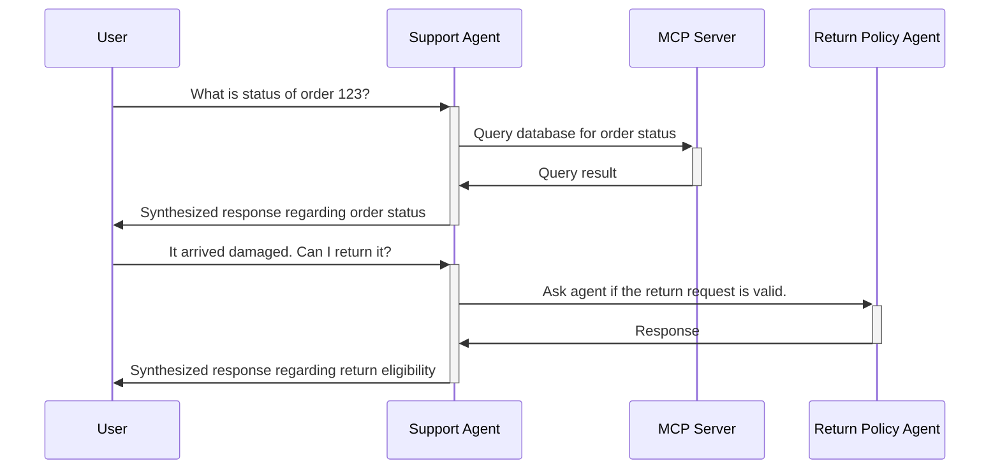

# A2A + MCP Demo Application

This repository contains a demo application that demonstrates the use of Agent-to-Agent (A2A) communication and Model Context Protocol (MCP) capabilities. The application consists of two agents that communicate with each other to perform a simple task while using MCP tools.



## Getting Started

This project has been set up to run within a Docker container for ease of development and deployment. The following instructions will guide you through the process of setting up and running the application. However, the underlying services have been set up using `uv`, so you can also run them directly on your machine if you prefer.

### Prerequisites

- Docker
- VSCode
    - Make sure to have the `ms-vscode-remote.remote-containers` extension installed for development within a container.
- Ollama + running model
    - Currently using `nemotron-3-nano:4b` for testing

### Running the Application

1. Clone the repository.
2. Open the project in VSCode.
3. Open the Command Palette (Ctrl+Shift+P) and select `Dev Containers: Rebuild and Reopen in Container`. This will take a few minutes depending on your system and internet connection.
4. Once the development container is set up, you can start the auxiliary applications by running the following command in the terminal:
   ```bash
   docker compose up -d
   ```
5. To run the main application, execute the following command in the terminal (make sure your venv is activated, i.e. `source .venv/bin/activate` if it's not already):
   ```bash
   make web
   ```
6. Open your browser and navigate to `http://localhost` to see the application in action.
